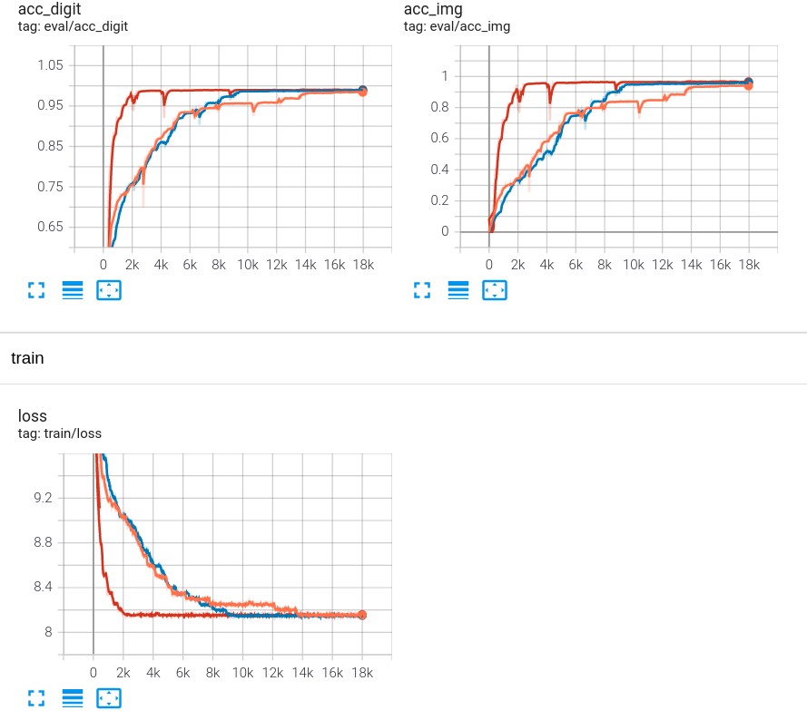

# THSR-captcha-solver

**僅供學術研究用途，請勿使用於其他用途。**

The original training codes come from [y252328/THSR-captcha-solver](https://github.com/y252328/THSR-captcha-solver), and the training samples and preprocessing codes come from [gary9987/Keras-TaiwanHighSpeedRail-captcha](https://github.com/gary9987/Keras-TaiwanHighSpeedRail-captcha). Thanks for their good work!

- [THSR-captcha-solver](#thsr-captcha-solver)
  - [Introduction](#introduction)
  - [Installation](#installation)
  - [Preperation](#preperation)
  - [Training](#training)
  - [Reference](#reference)

## Introduction

This project uses the convolutional neural network(CNN) to solve the captcha in Taiwan High Speed Rail booking website, and uses pytorch to implement it.

## Installation

### Conda
```
conda env create -f environment.yml
conda activate THSR_captcha
```

## Preperation
Download dataset and trained model [link](https://drive.google.com/drive/folders/1DH3xp4PEQYBavvNnK9kLeGn0rOsB81bp?usp=sharing)

### Folder architecture
```
dataset/
  - test/
    - ori/
    - img_processed/
    - labels.csv
  - train/
    - img_processed/
    - labels.csv
  - YOUR_CRAWLED_DATA/
    - ori/
    - img_processed/
    - labels.csv
  - crawl_img.py
  - img_process.py
```

### Crawl other data
```
python dataset/crawl_img.py
```

## Training
``` 
python src/train.py
```
It stores the highest accuracy model in `checkpoints/`

accuracy curve below shows no much difference with image preprocessing
* blue: torch / ori image
* orange: torch / aug img
* red: tensorflow / ori image



## Reference
[1] [simple-railway-captcha-solver](https://github.com/JasonLiTW/simple-railway-captcha-solver)\
[2] [[爬蟲實戰] 如何破解高鐵驗證碼 (1) - 去除圖片噪音點?](https://youtu.be/6HGbKdB4kVY)\
[3] [[爬蟲實戰] 如何破解高鐵驗證碼 (2) - 使用迴歸方法去除多餘弧線?](https://youtu.be/4DHcOPSfC4c)\
[4] [pytorch-book](https://github.com/chenyuntc/pytorch-book)\
[5] [Keras-TaiwanHighSpeedRail-captcha](https://github.com/gary9987/Keras-TaiwanHighSpeedRail-captcha)
